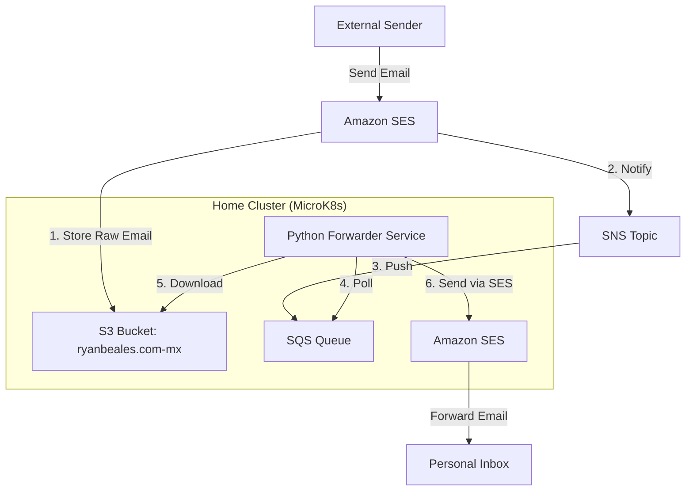

# ryanbeales.com

Infrastructure and services for the `ryanbeales.com` website.

## Email Forwarding System

This project implements a private email forwarding system for `*@ryanbeales.com`. It captures all incoming emails and forwards them to a personal email address using a service running in the home Kubernetes cluster.

### Architecture

The system uses a combination of AWS services (managed via Crossplane) and a local Python service to ensure privacy and low cost.



### How it Works

1.  **Capture**: SES is configured with a Receipt Rule that matches all recipients for `ryanbeales.com`.
2.  **Storage**: Incoming emails are stored as raw files in a private S3 bucket.
3.  **Notification**: SES publishes a notification to an SNS topic, which in turn pushes the message to an SQS queue.
4.  **Processing**: A Python service running in the home cluster polls the SQS queue using "Long Polling" (efficiency).
5.  **Forwarding**: The service downloads the raw email from S3, rewrites the headers (setting the `From` to a verified identity and the original sender in `Reply-To`), and sends it out via SES.
6.  **Cleanup**: Once successfully forwarded, the raw email is deleted from S3 to keep storage costs at zero.

### Setup and Configuration

#### 1. AWS Infrastructure (Crossplane)
The following manifests manage the AWS side of the system:
- `ses/`: Domain identity, receipt rules, and SNS/SQS notification resources.
- `s3/`: Bucket and policy for storing incoming mail.
- `ses/iam-forwarder.yaml`: Dedicated IAM user for the home cluster service.

#### 2. Home Cluster Service (ArgoCD)
The forwarder is deployed as a Kubernetes Deployment in the `ryanbeales-com` namespace.
- `email-forwarder/`: Deployment, ConfigMap (Python script), and ArgoCD manifest.

#### 3. Required Manual Steps
To maintain privacy, the destination email address and AWS credentials are NOT stored in Git. You must create a local secret in the cluster:

```powershell
# Create the config secret for the destination email
kubectl create secret generic email-forwarder-config `
  --from-literal=destination_email="YOUR_PERSONAL_EMAIL@HERE.COM" `
  -n ryanbeales-com
```

The AWS credentials for the forwarder are automatically written to a secret by Crossplane:
- Secret Name: `ryanbeales-email-forwarder-creds`
- Key mappings are handled in `email-forwarder/deployment.yaml`.

### Content Sync Service

The content for the website is hosted in a private GitHub repository (`ryanbeales/wwwryanbealescom`) and is automatically synced to the S3 bucket using a Kubernetes CronJob.

- **Location**: `sync/`
- **Mechanism**: A CronJob runs periodically to clone the private repo (using a GitHub Deploy Key) and perform an `aws s3 sync`.
- **IAM**: A Crossplane-managed IAM user and policy provide the necessary write access to the S3 bucket.
- **Setup**: Requires a `github-deploy-key` secret in the `ryanbeales-com` namespace. See [sync/README.md](sync/README.md) for detailed key generation instructions.

### DNS Management

All DNS records for `ryanbeales.com` are managed via Crossplane as Route53 `ResourceRecordSet` resources.

- **Location**: `dns/`
- **Record Types**:
    - **Validation**: ACM certificate and SES domain verification records.
    - **Routing**: Alias records for the CloudFront distribution (Apex and `www`).
    - **Services**: SES MX, SPF, DKIM, and DMARC records for email deliverability.
    - **Infrastructure**: Direct and wildcard records for cluster nodes (e.g., `crobasaurusrex`).
- **Note**: The Hosted Zone itself is currently managed manually to avoid accidental deletion/recreation, but all records within it are declaratively defined here.

### Cost Efficiency
- **SNS/SQS**: Entirely within the AWS Free Tier for personal volumes.
- **SES**: Incoming is free for the first 1,000/mo. Outgoing is $0.10 per 1,000 emails.
- **S3**: Near-zero due to immediate deletion after processing.
