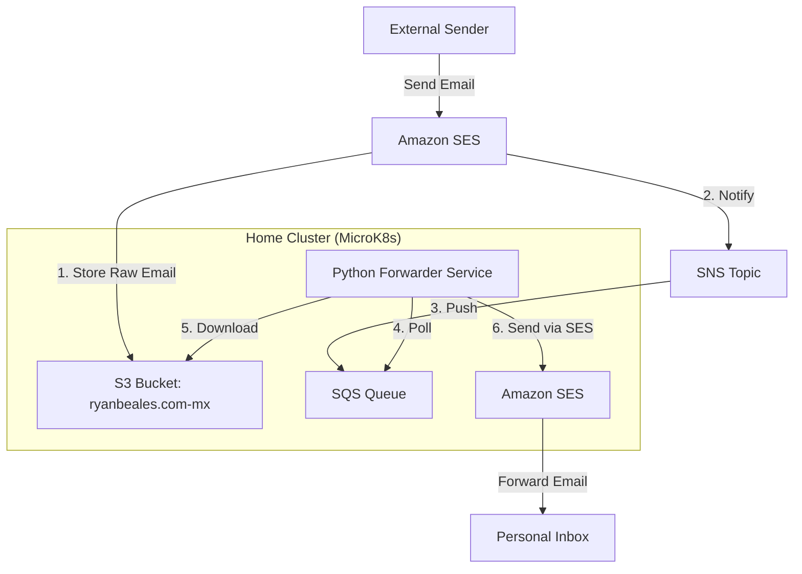

# 𓂸𓂸.com (xn--fu7da.com)

Infrastructure and services for the `xn--fu7da.com` (𓂸𓂸.com) website.

## About Punycode

This domain is an Internationalized Domain Name (IDN). "Punycode" is the encoding used to represent Unicode characters in ASCII, which is the only character set supported by the underlying DNS system.

- **Unicode**: 𓂸𓂸.com (Two instances of U+130B8)
- **Punycode**: xn--fu7da.com

**Character Details**:
*   **Symbol**: 𓂸 (EGYPTIAN HIEROGLYPH D052)
*   **Reference**: [Unicode Explorer: U+130B8](https://unicode-explorer.com/c/130B8)

> [!NOTE]
> **Display Issues**: This character is part of the "Egyptian Hieroglyphs" unicode block and may not display correctly on all systems (appearing as a square or question mark) if the operating system lacks a font with support for this range. My standard Windows installation does not include a font for these hieroglyphs by default.

> [!WARNING]
> **Gmail Limitation**: While you can receive emails at `admin@𓂸𓂸.com`, Gmail currently does not support sending emails to addresses containing unicode characters. Senders must use the Punycode address (e.g., `admin@xn--fu7da.com`) in the `to:` field of the email.

## Email Configuration

This domain uses the existing email forwarding infrastructure built for `ryanbeales.com` to handle incoming mail for `*@xn--fu7da.com`.

### Architecture

The system reuses the forwarder service running in the home Kubernetes cluster.

### How it Works

1.  **Receipt Rule**: A Receipt Rule in the `ryanbeales-rules` set captures email for `xn--fu7da.com`.
2.  **Shared Resources**: It uses the *same* S3 bucket (`ryanbeales.com-mx`) and SNS Topic as the main domain.
3.  **Processing**: The `email-forwarder` service processes these messages identically to `ryanbeales.com` emails.
    *   It identifies the recipient (e.g., `admin@xn--fu7da.com`).
    *   It rewrites headers and forwards the email to the configured destination.

## DNS & Infrastructure

DNS is managed via Crossplane acting on AWS Route53.

*   **Zone ID**: `Z08351656086KJO2313`
*   **Mail From**: `mail.xn--fu7da.com` (Validated via SES)
*   **SPF/DKIM**: Configured to authorize Amazon SES.

### Directory Structure

*   `dns/`: Route53 records (MX, TXT/SPF, CNAME/DKIM).
*   `ses/`: SES Domain Identity and verification resources.